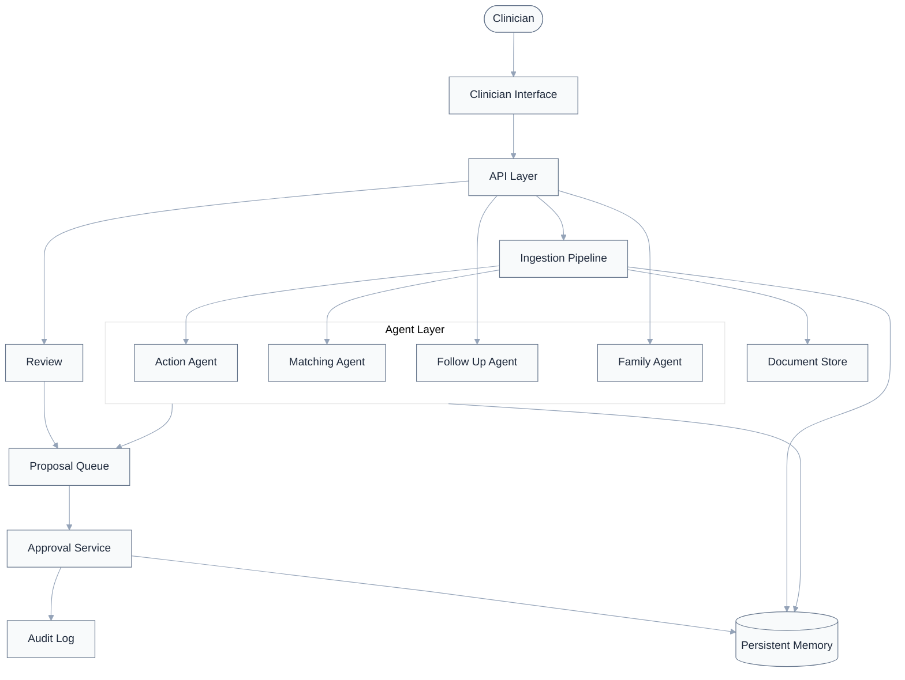

# CareThread

[](LICENSE)

A jurisdiction-aware care-continuity agent. It watches clinical documentation
for follow-up obligations that get recommended and then quietly dropped —
most commonly an incidental imaging finding that never makes it into the
discharge paperwork — and keeps that obligation alive as an auditable case
until a clinician confirms it's resolved.

Every agent only *proposes*; a single Approval Service is the sole path for
state changes, and every mutation is written to an immutable audit log.

## Architecture



- **Action / Matching / Follow Up / Family agents** — detect care gaps, match new
  evidence to open obligations, escalate overdue threads, flag hereditary risk
- **Proposal Queue → Approval Service** — every agent action waits for clinician
  sign-off before it touches state
- **Persistent Memory** — obligations, evidence links, embeddings, structured
  clinical facts, all patient-scoped

## Tech stack

| Layer | Stack |
|---|---|
| Backend | FastAPI, SQLAlchemy |
| Database | CockroachDB Cloud (or local Postgres + pgvector) |
| AI | Amazon Bedrock — Claude (extraction, evidence matching) + Titan Text Embeddings v2 |
| Storage | Amazon S3 (raw artifacts), falls back to local disk |
| Frontend | Next.js |

`CARETHREAD_AI_PROVIDER=local` runs the whole pipeline offline with
deterministic regex/hash stand-ins — also the automatic fallback if a Bedrock
call fails.

## Quick start

**Prerequisites:** Python 3.10+, Node.js 18+, a Postgres/pgvector or
CockroachDB instance, and (optionally) AWS credentials with Bedrock + S3 access.

```bash
# Database (local option)
docker run -d --name carethread-pg -e POSTGRES_USER=carethread \
  -e POSTGRES_PASSWORD=carethread -e POSTGRES_DB=carethread \
  -p 5434:5432 pgvector/pgvector:pg16

# Backend
cd backend
python -m venv .venv && source .venv/bin/activate
pip install -r requirements.txt
cp .env.example .env          # set DB URL, AI provider, AWS keys
python seed.py                # drops + recreates tables, loads demo data
uvicorn app.main:app --port 8002 --reload

# Frontend
cd frontend
npm install
echo "NEXT_PUBLIC_API_BASE=http://localhost:8002" > .env.local
npm run dev
```

Backend: http://localhost:8002/docs · Frontend: http://localhost:3000

> `seed.py` drops every table — skip it if you're joining an already-seeded database.

## Configuration

Key variables in `backend/.env` (see `.env.example` for the full list):

| Variable | Purpose | Default |
|---|---|---|
| `CARETHREAD_DATABASE_URL` | SQLAlchemy connection string | local Postgres |
| `CARETHREAD_AI_PROVIDER` | `bedrock` or `local` | `local` |
| `CARETHREAD_AWS_REGION` | Bedrock/S3 region | `us-east-1` |
| `CARETHREAD_S3_BUCKET` | Raw artifact storage; empty = local disk | empty |

## Testing

```bash
cd backend
pytest              # mock/local provider only, no AWS calls
pytest -m bedrock   # opt-in: exercises real Bedrock
```

## License

Apache License 2.0 — see [LICENSE](LICENSE).
